  

  

  
  

---

<table align="center"><tr><td>
<pre>
╭─ guest@shreyit ──────────────────────────────────────────────╮
│ $ whoami                                                     │
│ > Shreyit Sinha  --  AI / MLOps                              │
├──────────────────────────────────────────────────────────────┤
│ $ cat currently.txt                                          │
│ > building RAG pipelines + LLM evaluation harnesses          │
│ > automating video &amp; animation render pipelines              │
│ > mapping data across geo + field research                   │
├──────────────────────────────────────────────────────────────┤
│ $ ./deploy.sh --target=production                            │
│ > [========================================] 100%  shipped   │
╰──────────────────────────────────────────────────────────────╯
</pre>
</td></tr></table>

---

###  Tech Arsenal

  <b>Languages</b> 

  
  
  
  
  
  

  <b>Data & ML</b> 

  
  
  
  
  
  

  <b>GenAI / LLM</b> 

  
  
  
  

  <b>Backend & Data Stores</b> 

  
  
  
  
  

  <b>Infra & DevOps</b> 

  
  
  
  
  
  

  <b>Visualization & GIS</b> 

  
  
  
  
  
  

  <b>Research & Automation</b> 

  
  
  
  
  
  
  

---

###  GitHub Stats

  
  
  

---

###  Contribution Graph

  <picture>
    <source
      media="(prefers-color-scheme: dark)"
      srcset="https://raw.githubusercontent.com/Shreyit/Shreyit/output/github-contribution-grid-snake-dark.svg"
    />
    <source
      media="(prefers-color-scheme: light)"
      srcset="https://raw.githubusercontent.com/Shreyit/Shreyit/output/github-contribution-grid-snake.svg"
    />
    
  </picture>

---

###  GitHub Trophies

  

---

###  Connect

  

  

  

  
    Brewed with
    ,
    RAG pipelines.
  

  

